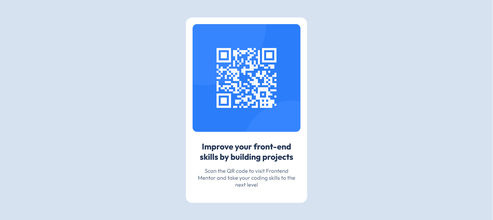

# Frontend Mentor - QR code component solution

This is a solution to the [QR code component challenge on Frontend Mentor](https://www.frontendmentor.io/challenges/qr-code-component-iux_sIO_H). Frontend Mentor challenges help you improve your coding skills by building realistic projects. 

## Table of contents

- [Overview](#overview)
  - [Screenshot](#screenshot)
  - [Links](#links)
- [My process](#my-process)
  - [Built with](#built-with)
  - [What I learned](#what-i-learned)
- [Author](#author)
- [Acknowledgments](#acknowledgments)

## Overview

### Screenshot

### Links

- Solution URL: [View Solution](https://frontend-u2oq.vercel.app/)
- Live Site URL: [Live site URL](https://kunal1943.github.io/Frontend/qr-code/)

## My process

### Built with

- Semantic HTML5 markup
- CSS custom properties
- Flexbox
- CSS Grid
- Mobile-first workflow

### What I learned

- How to center a card using Flexbox
- Using `hsl()` for better color control
- Creating reusable class structures
- Applying responsive width and padding
- Using external fonts from Google Fonts

## Author

- Website - [Kunal Keshri](https://www.your-site.com)
- Frontend Mentor - [@kunal1943](https://www.frontendmentor.io/profile/kunal1943)

## Acknowledgments

This project was built as part of a challenge from Frontend Mentor. Thanks to their platform for providing real-world frontend practice opportunities with clear, beginner-friendly designs.
